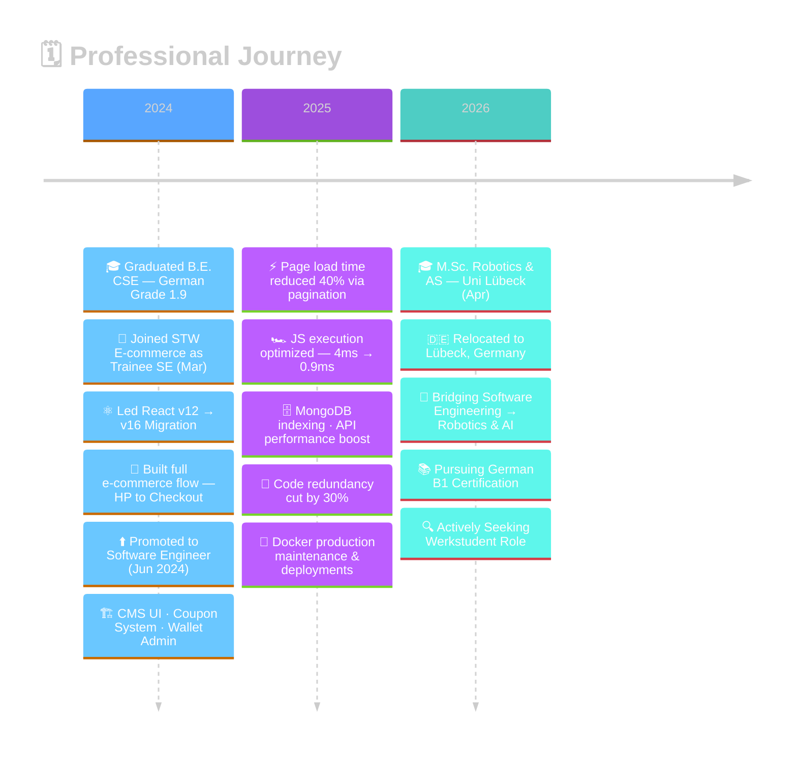

<!-- ████████████████████████  HEADER WAVE  ████████████████████████ -->


<!-- ████████████████████████  TYPING ANIMATION  ████████████████████████ -->
<!-- <div align="center">
  
</div> -->

<br/>

<!-- ████████████████████████  SOCIAL BADGES  ████████████████████████ -->
<div align="center">

[](https://www.linkedin.com/in/hari-krishna-1a9022211/)
[](https://harikrishnabaskaran-portfolio.vercel.app/)
[](mailto:harikrishnabaskaran2002@gmail.com)
[](https://github.com/harikrishnabaskaran)


</div>

<br/>

---

<!-- ████████████████████████  IMPACT METRICS  ████████████████████████ -->

## ⚡ Impact at a Glance

<div align="center">

| 🚀 Metric | 📊 Before | ✅ After | 🛠 How |
|:---:|:---:|:---:|:---:|
| Page Load Time | Slow 🐢 | **↓ 40% faster** | Pagination + asset optimization |
| JS Execution | 4 ms | **0.9 ms ⚡** | Dead code elimination |
| Code Redundancy | High | **↓ 30%** | Reusable function architecture |
| ML Accuracy | — | **96.5% 🎯** | CNN + Random Forest |

</div>

---

<!-- ████████████████████████  ABOUT ME — REDESIGNED  ████████████████████████ -->

## 👨‍💻 About Me

<br/>

<table border="0" width="100%" cellpadding="0" cellspacing="0">
<tr>
<td valign="top" width="50%">

<h3>🪪 &nbsp;Profile</h3>

<table border="0" cellpadding="6">
  <tr>
    <td>📛</td>
    <td><b>Name</b></td>
    <td>Harikrishna Krishnaramanujam Baskaran</td>
  </tr>
  <tr>
    <td>📍</td>
    <td><b>Based In</b></td>
    <td>Lübeck, Germany 🇩🇪</td>
  </tr>
  <tr>
    <td>🎓</td>
    <td><b>Studying</b></td>
    <td>M.Sc. Robotics &amp; AS — Uni Lübeck (Apr 2026–)</td>
  </tr>
  <tr>
    <td>🏅</td>
    <td><b>B.E. Grade</b></td>
    <td>1.9 (German Scale) · CSE, Chennai 2024</td>
  </tr>
  <tr>
    <td>💼</td>
    <td><b>Experience</b></td>
    <td>2 yrs Full-Stack @ STW E-commerce</td>
  </tr>
  <tr>
    <td>🔑</td>
    <td><b>Work Auth</b></td>
    <td>Aufenthaltstitel · 20 hrs/wk · No visa needed</td>
  </tr>
  <tr>
    <td>📬</td>
    <td><b>Contact</b></td>
    <td>harikrishnabaskaran2002@gmail.com</td>
  </tr>
  <tr>
    <td>🔍</td>
    <td><b>Open To</b></td>
    <td>Werkstudent · SWE Intern · Robotics Roles</td>
  </tr>
</table>

</td>
<td width="4%"></td>
<td valign="top" width="46%">

<h3>🚀 &nbsp;Currently Focused On</h3>

<br/>

<ul>
  <li>⚛️ &nbsp;<b>React.js · TypeScript · Redux · Node.js</b></li>
  <li>🤖 &nbsp;<b>Robotics &amp; Autonomous Systems (M.Sc.)</b></li>
  <li>🇩🇪 &nbsp;<b>German Language — Targeting B1 Certification</b></li>
  <li>🐳 &nbsp;<b>Docker · DevOps · Performance Engineering</b></li>
  <li>🌿 &nbsp;<b>CNN / ML &amp; Deep Learning Research</b></li>
  <li>📂 &nbsp;<b>Open Source Contributions</b></li>
</ul>

<br/>

<blockquote>
💡 <b>Fun Fact:</b> I squeezed JavaScript runtime from <b>4ms → 0.9ms</b> through dead-code elimination — that's <b>4.4× faster execution</b>. Not a tweak. Mastery. ⚡
</blockquote>

</td>
</tr>
</table>

<br/>

<div align="center">

**⚙️ Core Stack**


</div>

---

<!-- ████████████████████████  JOURNEY TIMELINE — MERMAID  ████████████████████████ -->

## 🗓️ Journey — 2024 · 2025 · 2026



---

<!-- ████████████████████████  GITHUB STATS — DETAILED  ████████████████████████ -->

## 📈 GitHub Stats — 2024 · 2025 · 2026

> All metrics include private repositories across **2024, 2025 and 2026**

<div align="center">
  
  
</div>

<br/>

<div align="center">
  
  
  
</div>

<br/>

<div align="center">
  
  
</div>

<br/>

<div align="center">
  
</div>

<br/>

<div align="center">
  
</div>

---

<!-- ████████████████████████  TROPHIES — FIXED  ████████████████████████ -->


<div align="center">
  
</div>

---

<!-- ████████████████████████  LANGUAGE DISTRIBUTION (CODE)  ████████████████████████ -->

## 🌐 Code Language Distribution

<div align="center">
  
</div>

---

<!-- ████████████████████████  TECH STACK  ████████████████████████ -->

## 🛠️ Tech Stack

**⚛️ Frontend**


**🔧 Backend & Database**


**⚙️ DevOps & Tools**


---

<!-- ████████████████████████  FEATURED PROJECT  ████████████████████████ -->

## 🔬 Featured Project

### 🌿 Medicinal Plant Identification Using Deep Learning

<table>
  <tr>
    <td><b>Tech Stack</b></td>
    <td>
      
      
      
      
      
      
    </td>
  </tr>
  <tr>
    <td><b>Accuracy</b></td>
    <td>🎯 <b>96.5%</b> on Kaggle dataset</td>
  </tr>
  <tr>
    <td><b>Pipeline</b></td>
    <td>Image preprocessing → Feature extraction → Model training → Deployment</td>
  </tr>
  <tr>
    <td><b>Model</b></td>
    <td>Hybrid CNN + Random Forest — deep feature extraction meets traditional ML</td>
  </tr>
  <tr>
    <td><b>Output</b></td>
    <td>End-to-end automated medicinal plant identification &amp; information system</td>
  </tr>
</table>

---

<!-- ████████████████████████  EXPERIENCE  ████████████████████████ -->

## 💼 Professional Experience

<div align="center">

| Role | Company | Period | Key Win |
|:---|:---|:---:|:---:|
| **Software Engineer** | STW E-commerce Pvt. Ltd., Chennai | Jun 2024 – Feb 2026 | ⚡ 40% load time ↓ |
| **Trainee Software Engineer** | STW E-commerce Pvt. Ltd., Chennai | Mar 2024 – May 2024 | ⚛️ React v12→v16 |

</div>


<!-- ████████████████████████  CONTRIBUTION ACTIVITY — REPLACES BROKEN SNAKE  ████████████████████████ -->

<div align="center">
  
</div>

<br/>

<div align="center">
  
</div>


<br/>

Create `.github/workflows/snake.yml` inside your profile repository (`harikrishnabaskaran/harikrishnabaskaran`):

```yaml
name: Generate Snake Animation
on:
  schedule:
    - cron: "0 0 * * *"   # runs daily at midnight
  workflow_dispatch:         # lets you trigger it manually too
jobs:
  generate:
    runs-on: ubuntu-latest
    steps:
      - uses: Platane/snk/svg-creator@v3
        with:
          github_user_name: ${{ github.repository_owner }}
          outputs: |
            dist/github-snake.svg
            dist/github-snake-dark.svg?palette=github-dark
      - uses: crazy-max/ghaction-github-pages@v3.1.0
        with:
          target_branch: output
          build_dir: dist
        env:
          GITHUB_TOKEN: ${{ secrets.GITHUB_TOKEN }}
```

After the workflow runs once (go to **Actions → Run workflow**), replace the heatmap image above with:
```
https://raw.githubusercontent.com/harikrishnabaskaran/harikrishnabaskaran/output/github-snake-dark.svg
```

</details>

---

<!-- ████████████████████████  EDUCATION  ████████████████████████ -->

## 🎓 Education

<div align="center">

| Degree | Institution | Year |
|:---|:---|:---:|
| 🤖 M.Sc. Robotics & Autonomous Systems | University of Lübeck 🇩🇪 | Apr 2026 – Present |
| 💻 B.E. Computer Science & Engineering &nbsp;`Grade: 1.9` | S.A. Engineering College, Chennai 🇮🇳 | Apr 2024 |

</div>

---

<!-- ████████████████████████  LANGUAGE PROFICIENCY — REDESIGNED  ████████████████████████ -->

## 🌍 Language Proficiency

<br/>

<div align="center">

<table border="0" cellpadding="24" cellspacing="0">
<tr>

<td align="center">


<br/><br/>


<br/><br/>

<sub><i>Full Professional Proficiency &nbsp;·&nbsp; Working Level</i></sub>

</td>

<td width="80"></td>

<td align="center">


<br/><br/>


<br/><br/>

<sub><i>Elementary &nbsp;·&nbsp; Actively Pursuing B1 Certification</i></sub>

</td>

</tr>
</table>

</div>

---

<!-- ████████████████████████  WERKSTUDENT CTA  ████████████████████████ -->

## 🤝 Let's Connect

<div align="center">

### 🇩🇪 Actively seeking Werkstudent roles in Germany

> ✅ Valid *Aufenthaltstitel zu Studienzwecken* &nbsp;|&nbsp; ✅ Up to **20 hrs/week** &nbsp;|&nbsp; ✅ **No visa sponsorship needed**

<br/>

[](mailto:harikrishnabaskaran2002@gmail.com)
[](https://www.linkedin.com/in/hari-krishna-1a9022211/)
[](https://harikrishnabaskaran-portfolio.vercel.app/)

</div>

---

<!-- ████████████████████████  QUOTE  ████████████████████████ -->

<div align="center">
  
</div>

<br/>

<!-- ████████████████████████  FOOTER WAVE  ████████████████████████ -->

